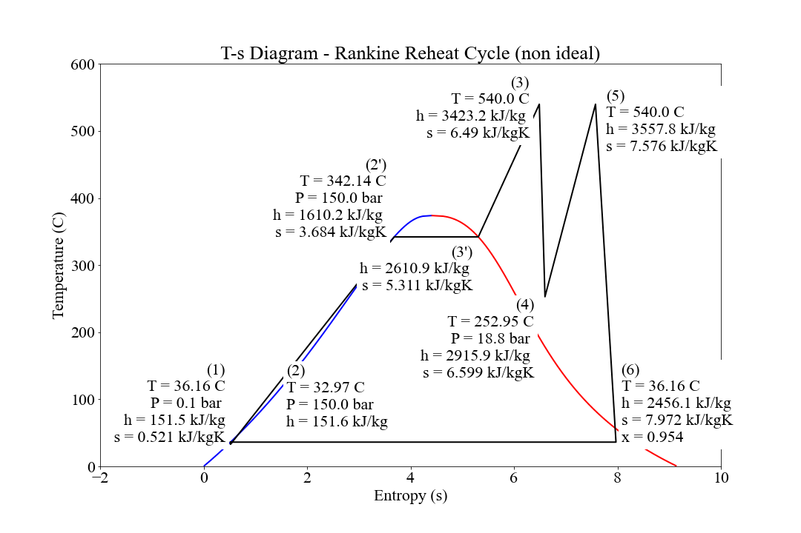
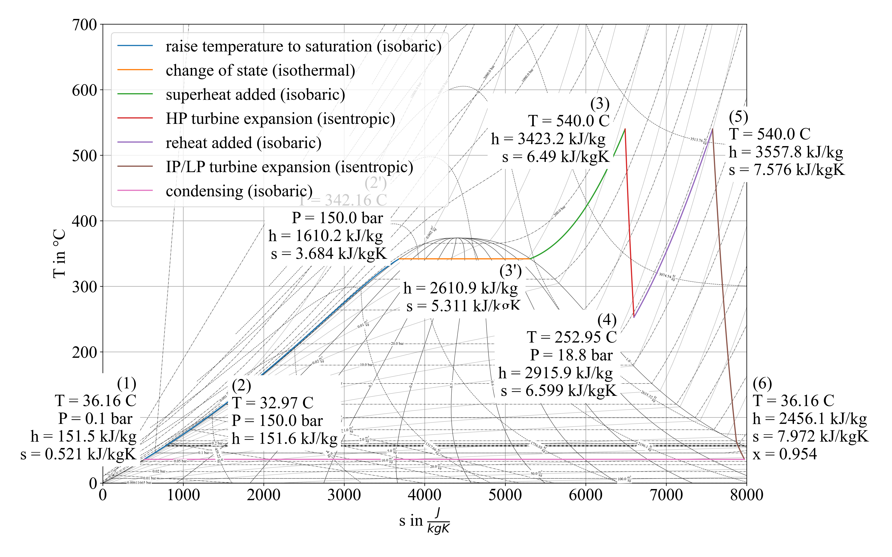

# steam-cycles-non-ideal
Display T-s (Temperature-Entropy) diagrams for various non-ideal steam cycles (rankine superheat and rankine reheat). 

Code will calculate properties and overall efficiency then display to plot.

## HiRes output
Also it is possible to display a similar diagram at higher resolution.

Please feel free to use/modify to your hearts content. The code is not the prettiest or the best and I in no way claim to be a programmer (It's just a hobby). If you think you can improve it, please go ahead.
